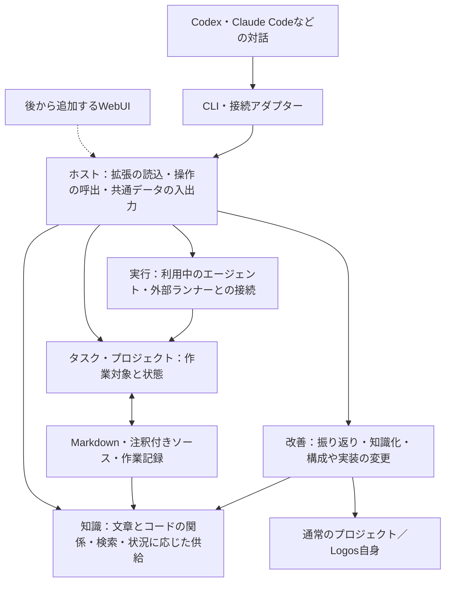

# Logos 初期版の設計

作成日：2026-09-10  
更新日：2026-09-10（Markdownと実装ソースを共通の関係で扱う方針を反映）  
状態：実装に向けた初期設計。以下はこれから作る構成であり、実装済みの機能を示すものではない。

## 1. 目的と設計の判断基準

Logosは、エージェントが状況に合った知識と実行方法を利用して仕事を進め、その経験や外部から得た情報を使って、自身の知識・能力・構成を改善していくための基盤である。

利用者が毎回、関連資料や注意点、作業方法を一から教える負担を減らす。改善の対象には、知識、ツール、エージェントの設定、作業手順、知識の選び方、評価方法、本体や拡張機能の実装を含む。既存の問題を直すことに加え、新しい能力や方法を獲得できることを目指す。

普段の入口はCodexやClaude Codeなどでの対話とする。そこから知識を参照し、作業を進め、必要なら別の実行方法へ委譲する。WebUIは後から追加し、知識の検索・閲覧・グラフ表示、タスクや進捗、接続プロジェクトの確認と補助操作に使う。

文章による説明はMarkdown、プログラムは実装ソースを原本とする。それぞれにオントロジー注釈を置き、資料の章、概念、判断基準、コードの関数やクラス、利用可能な機能を共通の関係で扱う。エージェントは知識から実装へ、実装から意味や根拠へ辿り、そのつながりを使って仕事と改善を進める。

初期版では、次の基準で実装範囲を決める。

1. 目的に必要な流れを、実際に使える形で一周成立させる。
2. 後からの変更が、蓄積した知識や多数の拡張機能に波及する部分を先に設計する。
3. 具体的な用途がない抽象化や、将来の可能性だけを理由にした仕組みは追加しない。
4. 通常の利用・変更は、利用者とエージェントの善意を前提にする。
5. 知識の消失など、損失が大きい操作には初期から保護を設ける。

過去の資料は目的を理解する参考とする。過去の実測・検証結果、資料に書かれた作り直しの理由、各版の厳密な管理要件は、この設計の根拠として引き継がない。

## 2. 初期版でできること

最初に、通常のプロジェクトでの仕事と、Logos自身を改善する仕事を、同じ仕組みで扱えるようにする。

| 利用場面 | 初期版の動作 |
|---|---|
| 対話中に必要な知識を得る | タスク、プロジェクト、現在の状況から、関連知識・判断基準・手順・利用可能な能力を取得する。選ばれた理由と出典も辿れる |
| 作業を進める | 対話中のエージェントがそのまま作業する経路と、登録された実行アダプターへタスクを渡す経路を持つ |
| 状況を更新する | タスクの状態、途中で分かったこと、成果物、確認結果を記録し、必要な知識を引き直せる |
| 経験を次回に生かす | 修正や発見を、適用範囲と出典を持つ知識として追加・更新し、次のタスクで利用できる |
| 自分の構成を理解する | 利用可能な機能、その目的、依存先、実装場所、関連する設計や知識を調べられる |
| 自分を改善する | エージェントが構成や実装を調べ、知識・設定・拡張機能・本体を変更し、動作を確認して次の利用へ反映できる |
| 複数のプロジェクトを扱う | 対象プロジェクトを選び、プロジェクト固有の知識と共有知識を併せて利用する |

初期版は単一利用者のローカル環境を想定する。開発作業を最初の利用例にするが、知識やタスクの共通部分には、コード変更やGitリポジトリを必須とする項目を入れない。

## 3. 本体と拡張の構造

単一のローカルアプリケーションとして始める。小さなホストと、標準で同梱する拡張機能を、同じプロセスで動かす。



### ホストが持つもの

- 有効な拡張機能を読み込み、操作を名前で登録・呼び出す仕組み。
- 共通のID参照と取得の窓口。原本の読込や対象範囲の解釈は、知識拡張の読取器へ任せる。
- 呼出時のプロジェクト、作業ディレクトリ、タスクIDなどを渡す共通の文脈。
- 登録された機能を一覧し、その説明と実装場所を取得する仕組み。
- 管理するファイルや作業記録の安全な保存・復元を支える共通処理。

知識の順位付け、作業手順、モデル選択、振り返り方などの方針は、標準拡張側に置く。ホストを小さくするために必要機能を削らず、必要機能を交換できる場所に置く。

ホストも通常のソースコードとして変更可能にする。初期版では、稼働中のホストの自己書換えや、その場での入替えは扱わない。変更は確認後、次の起動から使う。

### 拡張機能の単位

拡張は、意味のまとまりごとのモジュールとする。初期には「知識」「タスク・プロジェクト」「実行」「改善」を標準拡張として同梱する。機能ごとに細かいパッケージを量産する必要はない。

拡張の定義には、ID、目的の説明、必要な拡張、提供する操作、設定、実装の入口を持たせる。各操作には、名前、説明、入力・出力の形、処理本体を対応付ける。ホストは同じ定義を、実際の呼出と、エージェント向けの機能説明に利用する。

操作には、対応する実装ノードのIDを持たせられる。注釈から得た「何を実装しているか」と、登録情報から得た「現在どう呼び出せるか」を、このIDで接続する。注釈を読み取るだけでは、対象コードを実行・登録しない。

| 初期から決める約束 | 後からの変更負担を減らす理由 |
|---|---|
| 操作名は拡張IDを含む。例：`knowledge.context` | 別の拡張を追加しても名前が衝突しにくい |
| 外から使う操作は、構造化した入力・出力を持つ | CLI、対話接続、後のWebUIが同じ機能を呼べる |
| 拡張間の呼出は公開された操作を使う | 別の拡張の保存形式や内部クラスへの依存を抑える |
| 実行環境の情報は呼出の文脈として渡す | 特定の対話製品や作業ディレクトリへの埋込みを避ける |
| 定義の読込時に、依存不足と操作名の重複を検査する | 起動しているように見えて一部だけ壊れている状態を減らす |

操作一覧、レコードの取得、操作の実行ができれば、新しい拡張を入口ごとに作り直す必要はない。初期の呼出は通常の関数呼出でよく、通信基盤やイベントバスを追加しない。

既存機能の互換な入替えでは、公開する操作名と入出力を保って実装を交換する。互換性がない変更では、新しい操作を用意して呼出側を移す。初期から自動的な互換性解決の仕組みは作らない。

拡張はローカル設定に明示したものを読み込む。配布マーケット、依存パッケージの自動導入、動的なホットリロード、拡張同士の権限隔離は後回しにする。

## 4. 知識と自己記述の情報モデル

### 原本と共通の関係

Markdownには概念、知識、設計意図、判断基準などの説明を書く。プログラムの判定・処理は通常のソースコードに実装する。両方の原本に共通のオントロジー注釈を付け、原本の対象箇所をノードとして取得・参照できるようにする。

たとえば、Markdownの章に「公開APIの項目を削除しない」という基準を記述し、実装関数に、その基準を実装しているという関係を付ける。基準の本文、関数のコード、その関係をそれぞれの原本から読み取る。判定ロジックをMarkdownへ移したり、ソースの内容を別の知識ファイルに複製したりする必要はない。

注釈の具体的な記法、対象範囲、読込処理、接続例は [文章・コード・オントロジーの設計](ONTOLOGY.md) に定める。

| 対象 | 原本 | 共通ビューで扱うもの |
|---|---|---|
| 概念・知識・判断基準 | Markdownの文書や章・節 | ID、種類、本文、関係、原本の位置 |
| 実装 | 関数・クラスなどのソースコード | ID、種類、コード、関係、原本の位置 |
| 利用可能な操作 | 拡張の実際の登録情報 | 操作名、入出力、実装ID、現在の利用可能状態 |
| タスク・実行 | タスク拡張の保存する記録 | 目的、状態、結果、利用した知識・実装への参照 |

共通ビューと関係の索引は原本から作る派生物とする。取得側はIDを使い、ファイル名や行番号を永続的な識別子にしない。一つのファイルに複数のノードを置ける。原本の編集は対象の文章・コード・注釈に対して行い、生成したビューを独立した原本として編集しない。

### 関係の意味と判断ロジック

初期の知識拡張は、概念の別名、上位概念への関係 `is_a`、個別対象の分類 `instance_of`、判断基準などの適用対象 `applies_to` を扱う。上位概念が複数あれば、そのすべてを辿って関連する知識を集める。プログラミング言語のクラス継承の順序には依存しない。

さらに、実装から基準への `implements`、テストから対象への `verifies`、要素間の `depends_on`、情報の由来を示す `derived_from` などを共通の関係として保持する。関係は一方に記述すれば逆方向にも問い合わせられる。依存先の基準を無条件に継承するなど、異なる関係の意味を混ぜない。

複雑な適用判定や評価は、必要に応じて通常の関数やクラスで実装し、対象の基準・知識と結ぶ。知識供給やタスク実行から使う場合は、拡張の公開操作として接続する。条件分岐を注釈のデータへ翻訳する処理系は初期には作らない。文章だけで扱う基準もそのまま利用できる。

新しいノードの種類や関係は、説明とともに追加できる。まず取得・検索・関係の探索に使い、特別な振る舞いが必要になったら拡張側に実装する。全語彙を事前に固定したり、すべての関係に実行処理を要求したりしない。

### 自己記述を実際の構成につなぐ

実装の注釈と、ホスト・拡張の登録情報を結び付けることで、エージェントは「何ができるか」から「どう呼ぶか」「何のためか」「どこを変えて確かめるか」へ辿れる。実行可能状態の正本は登録情報とし、注釈に有効・無効の状態を重複して書かない。

記述された意図や実装関係は、挙動の正しさを証明するものではない。変更後は関係する例やテストで確かめる。初期から全ソースコードの構造や全挙動を自動的にモデル化する必要はない。

## 5. 状況に合った知識を供給する

`knowledge.context` は、作業内容、対象プロジェクト、既知の概念、現在分かっていることを受け取る。対話中のエージェントは、途中で状況が変わったら再度問い合わせられる。

初期の処理は次の順序にする。

1. 対象プロジェクトの知識と共有知識に範囲を絞る。
2. 明示された概念IDを解決する。自然文からは名称・別名で候補を探し、必要なら呼出側エージェントが概念を補う。曖昧な対応は確定済みと扱わない。
3. 概念の分類・上位関係を辿り、適用対象が一致する知識を集める。この処理は本文検索の上位件数とは別に行う。
4. 本文検索と関連リンクから、追加の参考情報、手順、実装、確認方法を集める。コードから問い合わせた場合も、逆向きの関係を使って説明や基準を取得できるようにする。
5. 要点、適用理由、参照ID、原本の位置、登録済みの操作との対応をまとめて返す。詳しい文章・コードや関連情報はIDで追加取得できるようにする。

上位関係を辿るときは循環を検出する。参考リンクの探索には件数・深さの上限を設ける。適用対象に一致した知識が出力量を超える場合は、続きの有無と取得方法を返し、存在しなかったように扱わない。

関連情報の発見と、記述された条件に基づく適用を区別して返す。自然文の条件が不明、概念を特定できない、知識同士が矛盾する場合は、その状態を渡してエージェントの判断につなげる。初期版で未知の矛盾をすべて自動検出する仕組みは作らない。

適用判定の実装を利用する場合は、供給処理に接続した公開操作へ現在の状況を渡す。結果と理由を供給結果に添え、参照リンクだけを根拠に任意の関数を自動実行しない。注釈の対象が曖昧、参照が切れている、原本を読み取れない場合も取得結果に問題を示し、正常に解決できたように扱わない。

この方式の有効性は、概念の対応付けと登録された知識に依存する。初期版は、必要な知識の完全な網羅や、渡した知識が正しく使われたことを保証しない。結果の確認は、作業の成果物や確認記録を見て行う。

## 6. タスク、実行、改善をつなぐ

### 二つの作業経路

対話中のエージェントが作業する場合は、知識を取得し、対象プロジェクトで作業し、必要な結果をLogosに記録する。知識の参照だけなら、タスク登録を必須にしない。

作業を委譲する場合は、実行拡張へ、タスクID、対象プロジェクト、目的、必要な文脈、利用する実行アダプターを渡す。アダプターは外部エージェントや既存ツールに接続し、状態と結果をタスクに戻す。両方の経路で同じ知識供給とタスク操作を使う。

初期のタスクには、目的、プロジェクト、状態、状況のメモ、利用した知識・実行方法への参照、成果物の場所、確認結果を保持する。状態は未着手・実行中・待機中・完了・失敗・中止から始め、厳密な工程管理は追加しない。完了は実行側の報告で更新でき、確認結果がなければそのまま未確認と表示する。

委譲前に実行IDを保存し、タスクとは区別して試行を記録する。中断後に結果が不明なら、自動再実行せず状態を確認する。初期は手動の再開でよく、常駐キューや複雑な再試行制御は作らない。

CLIを最初の入口とし、利用環境に合わせた対話接続と、一つの実行アダプターを実装する。接続先ごとの呼出方式は実装時に確認して選ぶ。Skills、MCP、Hooks、既存SDKなどは必要な接続に利用し、すべてを初期の必須機能にはしない。

### 改善を初期版から一周させる

改善拡張は、タスクの結果、利用者の修正、外部資料、新しい仮説から、改善の作業を起こせるようにする。初期の判断と変更作業は、対話中または委譲先のエージェントが担う。

1. 経験や新しい情報から、改善したい点と期待する効果を短く記録する。
2. 共通の関係から、知識、機能の説明、設定、実装、確認方法を辿る。
3. 知識の追記、設定の変更、拡張の追加・交換、必要なら本体の修正を行う。
4. 対象に応じた例やテストで結果を確認し、変更内容と確認結果を記録する。
5. 原本を読み直し、更新された知識・関係・構成を次の作業で利用する。動作するコードを変更した場合は、確認後の次回起動から反映する。

同じエージェントが提案・変更・評価を進めてよい。独立した審査者、評価項目の改変禁止、複数段階の承認は初期には要求しない。期待した効果と、実際に確認できたことは記録上区別する。

振り返りではログ全体をそのまま一般知識にせず、使い回せる内容、適用範囲、出典を取り出す。一件の経験なら、まずそのプロジェクトや状況に限定して保存できる。知識を増やすだけでなく、重複の整理、誤りの修正、不要な機能の廃止も改善に含める。

Logos自身は、通常の作業対象プロジェクトとして登録する。自身の実装を変更する際も、通常の編集・確認・Gitブランチの流れを使う。並列作業で必要ならworktreeを使う。独自の版管理、複数リポジトリの一括固定、稼働中の自己更新機構は作らない。

## 7. 保存場所と保護

### 正本と作業対象

知識、拡張の設定、設計・実装は通常のファイルとして管理する。初期の実装はTypeScriptの一つのコードベースから始め、配置を次のようにする。これは実装時の目安であり、公開インターフェースにはしない。

TypeScriptは本体と最初のソース読取器の実装案であり、オントロジーを記述するための必須言語にはしない。他言語のソース対応は読取器と必要な実行アダプターを追加する。注釈の関係モデルは共通に保つ。

```text
src/host/                  拡張読込、操作呼出、共通の参照・保存処理
src/extensions/            標準拡張と接続アダプター
src/extensions/knowledge/  原本の読取器、関係の索引、知識供給
knowledge/                 共有知識、Logos自身についての知識
config/                    有効な拡張など、共有する設定
.logos/local/              ローカルのプロジェクト接続先
.logos/tasks/              タスクと実行の記録
.logos/trash/              削除した管理データと復元用情報
.logos/cache/              作り直せる索引
```

プロジェクトはIDとローカルの作業場所で接続する。プロジェクト内のMarkdownとソースの読込範囲を登録し、共有知識と併せて扱う。対象プロジェクトのコードや資料をLogosへ丸ごと複製する必要はない。同じフォルダがLogos自身の実装と知識を持っていてもよい。

各知識の保存先と参照元を把握し、追加時には共有知識かプロジェクト固有かを選ぶ。他のプロジェクトの固有知識は、通常の文脈取得には混ぜない。初期の範囲指定は誤用防止であり、利用者間のアクセス制御ではない。

ソースコードと知識の変更履歴には通常のGitを使える。ローカルの接続設定、タスク記録、ごみ箱、索引は初期のGit管理から外す。索引は再生成できる派生物とし、まず単純に読み直してよい。データベースや差分索引は必要性を確かめてから追加する。

保存は一時ファイルに書いて検査してから置き換える。更新時には読込時点から原本が変わっていないか確認し、他の編集があれば上書きせずに再読込を求める。ファイル形式の変更が必要になったときに、その版間の移行処理を用意する。

文章やコードの変更では、対象範囲へ差分を適用し、関係のない本文や書式を再生成しない。索引からノードを消すだけでは原本は変わらないため、永続的な変更は原本側で行う。

### 初期から設ける保護

| 操作 | 初期の扱い |
|---|---|
| 通常の知識追加・修正、設定や実装の編集 | 毎回の承認を要求しない。構文・ID重複などの基本検査を行う |
| 管理する資料・章やタスクの削除 | 対象範囲と含まれるノードを示し、削除する原文と元の場所を復元できる形でごみ箱へ保存する。ファイルの一部だけを対象にできるようにする |
| 注釈や関係の削除 | その注釈を変更する。参照先の資料・実装は連鎖して削除しない。実装そのものの削除は通常のコード変更として扱う |
| ごみ箱からの復元 | 元の場所やIDが使用済みなら上書きせず、衝突を返す |
| ごみ箱の完全消去、知識の一括消去・一括置換 | 通常の整理処理では実行しない。対象と消失する内容を示し、利用者の明示的な指示を必要とする |
| 接続プロジェクトの解除 | 接続設定を外す。対象プロジェクトのファイルは削除しない |
| 外部への公開や、外部データの破壊的な変更 | 接続先・実行環境の既存の確認手段を使う。アダプターが確認を代行して済ませない |

削除後も残る参照は解決時に知らせ、ごみ箱の記録があるIDは削除済みと表示する。章を削除する場合は、その配下の節も対象範囲に含まれることを示す。部分削除の復元時に周囲が変わっていれば、無関係な編集を上書きせず差分を確認する。ごみ箱への保存と原本の変更は途中失敗でも原文を失わない順序で実装し、初期の確認対象に含める。自動でごみ箱を空にしない。

この保護は、Logosの管理操作を通した際の事故を減らすものである。同じ権限で動くエージェントや拡張による直接のファイル操作を封じるものではない。初期はこの境界を受け入れ、管理データは公開操作で扱う運用にする。

## 8. 実装の順序と完了の目安

初期版の実装は、以下の三段階で進める。各段階で実際の例を通し、不足が確認できた部分だけ設計を詳しくする。

### 段階1：知識と構成を対話から使う

ホスト、知識拡張、MarkdownとTypeScriptの読取器、プロジェクト接続、CLIを作る。章と関数の注釈から共通の関係を作り、標準拡張の実際の登録情報につなぐ。知識の保存・参照・削除・復元を通す。

完了の目安は、一つの通常プロジェクトを接続し、対話から知識を取得できること。「返金処理」と「金銭処理」のように語句が異なる例で、概念関係から判断基準を取得し、理由と出典を辿れることも確かめる。

加えて、一つのMarkdown内の別々の章を別IDで取得でき、基準の章から実装関数へ、関数から基準の章へ辿れることを確認する。読取時には、ソースコードを実行しないことも確かめる。

### 段階2：作業と知識の更新をつなぐ

タスクの記録と実行アダプターを一つ作る。対話中の直接作業と、委譲した作業の両方を通す。途中の状況更新、失敗・中断の表示、結果からの知識更新までつなぐ。

文章で説明した判断基準に実装を一つ結び、登録された操作として呼び出し、判定結果と元の基準をタスクから確認できるようにする。複雑な条件はその実装内に書き、本体の条件式の種類を増やさずに対応できることを確認する。

完了の目安は、実際の作業で受けた修正を適用範囲付きで保存し、次の関連作業で取得できること。別プロジェクトの固有知識が通常の取得結果に混ざらないことも確認する。

### 段階3：自身を理解して改善する

改善拡張をつなぎ、Logos自身を対象プロジェクトとして使う。機能の説明から実装と確認方法へ辿り、小さな改善を行う。さらに、小さな拡張を追加して利用する例を通す。

完了の目安は、既存の処理の修正と、新しい能力の追加を、それぞれ一度動かせること。通常の拡張追加ではホストの実装を編集せずに操作を登録・呼出でき、必要な本体変更は通常の編集と次回起動で反映できることを確かめる。

ここまでで初期版とする。知識供給だけで完了にはしない。WebUIや自律的な常駐改善は、この後の拡張として扱う。

### 初期の確認に含めるもの

実際の利用例に加え、後で壊れると損失が大きい部分を確認する。

- ファイル移動、章の移動、関数名の変更後も、注釈IDを保てば参照が保たれること。重複IDや参照切れが見えること。
- 注釈が隣の章・関数や説明用のコード例に誤って結び付かないこと。曖昧な対象は問題として返すこと。
- 関係は片側だけの記述で双方向に辿れ、実装の発見と操作の利用可能状態を区別できること。
- 拡張の追加・無効化と、機能一覧・実際の呼出結果が一致すること。
- 概念の上位関係から知識を取得でき、循環した関係でも処理が終わること。
- 章の部分削除・復元、途中失敗、更新の競合で原本を失わず、他の章やリンク先のコードを変更しないこと。
- 実行失敗や中断を完了扱いせず、結果不明の作業を勝手に再実行しないこと。

評価には、今から作る実例と確認結果を使う。評価の不正耐性、固定された評価基盤、網羅的なベンチマーク整備は初期の完了条件にしない。

## 9. 今決めることと、実例を待つこと

| 今回の設計で採ること | 今決める理由 |
|---|---|
| 小さなホストと標準拡張、入口をまたいで共通の操作 | 後からUIや接続先を追加する際の本体改修を減らす |
| 場所から独立したID、意味を持つ関係、適用範囲、出典 | 蓄積した知識を移動・再利用・修正できる土台になる |
| 原本・注釈と、共通グラフを使う処理の分離 | 対応するソース言語や注釈記法を増やしても、利用側への変更の波及を抑える |
| 注釈の対象範囲と、プロジェクト範囲・適用条件の区別 | ファイル内の配置と、知識の意味や適用先を混同しない |
| ソースの実装IDと、実際の操作登録の接続 | エージェントが説明・コード・呼出方法を行き来できるようにする |
| 対象プロジェクトとLogosの保存場所の区別 | 他のプロジェクトの作業と、自身の改善を同じ仕組みで扱う |
| 復元可能な削除と基本的な保存時検査 | 初期から蓄積する知識の消失を減らす |

次の事項は、初期の例を作りながら判断する。必要な時点までに決めればよく、今すべてを設計しない。

- どの判断基準や適用判定を、文章での利用から実装による判定へ進めるか。
- 初期の直前配置に加えて、後置注釈や明示的な対象指定が必要か。
- どのソース言語の読取器・実行接続を次に追加するか。
- 全文検索、埋め込み、グラフ探索、エージェントの解釈をどう組み合わせると使いやすいか。
- 頻繁に使う作業のうち、どこを自動実行や定期実行にするか。
- WebUIにどの表示・操作を追加するか。
- 利用者や実行環境が増えたとき、どの管理や保護を強化するか。

この設計の良し悪しは、初期の機能が動くことに加え、次の機能追加や改善をしたときの変更範囲で確かめる。使う前に完成形を決め切ることは、初期版の目標に含めない。
