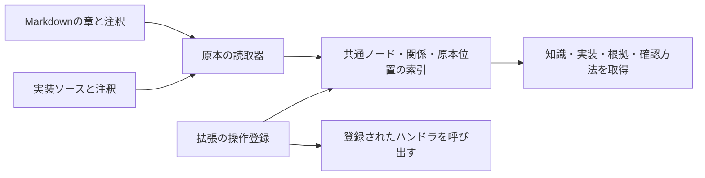

# 文章・コード・オントロジーの設計

作成日：2026-09-10  
状態：初期設計。実装はまだない。[全体設計](DESIGN.md) の情報モデルと原本の扱いを具体化する。

## 1. 何を原本にするか

文章で説明するものはMarkdown、プログラムは実装のソースコードを原本にする。両方の原本にオントロジー注釈を付け、概念・知識・判断基準・実装などを共通の関係として扱う。

判断基準の説明は、その意味、適用条件、理由、確認したい内容を文章で書く。機械的に判定する実装があれば、ソースの関数やクラスに注釈を付け、その基準を実装しているという関係を記述する。文章だけで利用する基準があってもよい。

オントロジー注釈は対象の識別・意味・関係を記述する小さなデータとし、初期にはYAMLを使う。条件分岐や計算は通常の実装コードに書く。Markdownの注釈を実行コードへ変換する仕組みや、判定ロジックを注釈用の条件式へ翻訳する仕組みは作らない。



索引は原本から作り直せるものとする。文章やコードの内容を別の正本へコピーせず、取得時には原本の該当範囲へ辿れるようにする。

## 2. 注釈が定義するノードと関係

一つの注釈で、対象となる章や宣言に一つのIDを付ける。一つの文書・ソースファイルに複数の注釈を置ける。ファイル全体を一ノードに固定しない。

| 注釈の項目 | 初期の意味 |
|---|---|
| `format` | 注釈形式の版。初期は `1` |
| `id` | ノードを識別する必須のID。例：`criterion/preserve-public-members` |
| `kind` | 概念、知識、判断基準、実装などの種類。初期語彙は `concept`、`knowledge`、`criterion`、`implementation` など |
| `title` | 任意の表示名。省略時は対象の見出しや宣言名を使う |
| `aliases` | 任意の別名。名称による発見に使う |
| `attach` | 原本内のどの範囲に注釈を結び付けるか。省略時は `next` |
| `scope` | 共有知識かプロジェクト固有か。`shared` またはプロジェクトID。省略時は読込元に設定した範囲 |
| `links` | 関係名 `relation` と参照先ID `target` の組の配列 |

`format`、`id`、`kind`を必須とし、それ以外は必要な場合だけ書く。新しい種類や関係を追加でき、独自項目も保持する。基本項目の誤りは問題として返す。型の厳密な階層や、すべての語彙の事前登録は要求しない。

読取器は、注釈に加えて以下を共通ビューへ載せる。

- `origin`：登録された読込元、そこからの相対パス、注釈の範囲、対象の範囲。
- `content`：対象となる文章またはコード。索引に保持する場合も派生物として扱う。
- 対象の種類や宣言名など、その読取器が確実に取り出せる情報。
- 参照切れ、重複ID、曖昧な対象など、読込時に見つけた問題。

IDはファイルパス、行番号、関数名と独立させる。注釈を対象と一緒に移動すれば、移動や名前変更の後も同じIDで参照できる。原本位置は読み直した際に更新する。削除したIDを別の意味へ使い回さない。

同じ読み込み範囲では、一つのIDに一つの主たる定義を持たせる。他の章から同じ概念を説明・参照する場合は、その章のノードから関係を張る。重複定義をファイルの読込順で上書きしない。実際の操作登録から得る情報は、実装IDへの参照として接続し、実装ノードの二つ目の定義にはしない。

外部資料のURLやファイルへの引用は通常のMarkdownリンクとして残せる。IDを持つ情報の由来は `derived_from` で結べる。原本の所在を示す `origin` と、内容の根拠・出典は区別する。

## 3. 注釈を原本のどこに結び付けるか

初期は、対象の直前に置く方式を採る。前後どちらに書いても近い方へ自動的に結び付ける方式にはせず、読込時に対象を一意に決める。後置注釈などの追加は、実例で必要になった時点で判断する。

ここでの `attach` は文書・ソース内の対象範囲を決める項目である。知識の共有範囲である `scope`、意味上の適用対象である `applies_to` とは別に扱う。

### Markdown

注釈には、情報文字列が `logos` のコードブロックを使う。初期は文書の最上位に置いたブロックだけを認識し、引用・リストの内部や、説明用コードブロックの内部は抽出対象にしない。

| 配置 | 対象範囲 |
|---|---|
| `attach: next`、または省略 | 空行を除く次のブロックが見出しなら、その見出しと章・節の内容 |
| `attach: file` | 文書全体。初期は文書冒頭に置く |

章・節の範囲は、見出しから、次に現れる同じか上位レベルの見出しの直前までとする。下位の節は範囲に含む。次の章に付く直前注釈は、その次の章に属するものとして範囲を分ける。

知識として渡す文章からは、認識したLogos注釈を取り除く。注釈自体と原本位置は別に取得できるようにする。下位の節にもIDがある場合は個別に取得できるが、親の章の関係や `scope` を自動的に継承させない。原本の包含関係と概念の `is_a` は別である。

注釈と見出しの間に本文などがある場合は、遠くの見出しへ飛ばずに「対象なし」とする。同じ対象への複数の定義注釈も問題として返す。注釈のない文章は普通のMarkdownとして扱え、必要な箇所から注釈を追加できる。

### ソースコード

ソースの注釈も同じYAML項目を使い、言語ごとのコメント内に置く。初期のTypeScript読取器では、内容が `@logos` で始まる専用のブロックコメントを認識する。

`attach: next` は、同じ構文上の範囲にある次の宣言へ結び付ける。間に置けるのは空白と説明コメントだけとし、無関係な文や宣言を飛び越えない。`export` や修飾子は宣言の一部として扱う。

最初に対応する対象は、関数、クラス、メソッド、一つの変数を定義する宣言とする。変数に代入した関数も、その変数宣言として扱える。`attach: file` はソース冒頭の注釈からファイル全体を対象にする。対象が複数に分かれる宣言や未対応の構文は、曖昧なまま結び付けず問題を返す。

文字列やテンプレートに書かれた `@logos` は注釈として扱わない。コメントと対象の宣言は言語の構文解析結果から取得し、行番号の近さだけで判断しない。読取のためにソースをimportしたり、実行したりしない。

他言語への対応は、コメントの抽出と対象範囲を返す読取器の追加として行う。共通ノードと関係を使う側は、言語ごとの構文に依存させない。

## 4. 判断基準と実装を結ぶ例

以下は二つの原本に置く記述の例であり、この設計書内のサンプルを登録対象にするものではない。

Markdown側では、概念と基準を別の節として記述する。

````markdown
```logos
format: 1
id: concept/public-api-change
kind: concept
scope: shared
```
## 公開APIの変更

外部の利用者が呼び出すAPIに変更を加える作業。

```logos
format: 1
id: criterion/preserve-public-members
kind: criterion
scope: shared
links:
  - relation: applies_to
    target: concept/public-api-change
```
## 公開項目を削除しない

変更前に公開していたAPIの項目名が、変更後にも存在することを確認する。
これは互換性確認の一項目であり、引数や返り値の変更などは別の基準で扱う。
````

ソース側には、この基準を判定する実際の処理と注釈を置く。

```typescript
/* @logos
format: 1
id: implementation/check-public-members
kind: implementation
scope: project/example
links:
  - relation: implements
    target: criterion/preserve-public-members
*/
export function checkPublicMembers(context: {
  before?: string[];
  after?: string[];
}) {
  if (context.before === undefined || context.after === undefined) {
    return { status: "unknown", reason: "比較する項目一覧が不足している" };
  }

  const after = new Set(context.after);
  const removed = context.before.filter(name => !after.has(name));
  return {
    status: removed.length === 0 ? "met" : "not_met",
    details: removed,
  };
}
```

関係はソース側に一度書けばよい。共通の索引は、関数から基準を取得する方向と、基準から実装を探す方向の両方を提供する。説明とコードを重複させる必要はない。

基準と実装は一対一に限定しない。一つの基準に複数の実装があっても、一つの実装が複数の基準に関わっていてもよい。`implements` は記述された対応を示し、すべての基準を満たすことの証明にはしない。

## 5. 初期に扱う関係

| 関係 | 向きと意味 | 初期の扱い |
|---|---|---|
| `is_a` | 下位概念 → 上位概念 | 複数の親を許し、上位へ辿る。共通の祖先は重複させない |
| `instance_of` | 対象 → 分類する概念 | 対象の分類から、概念の上位関係へ進める |
| `applies_to` | 知識・基準・手順 → 適用する概念 | 対象の分類に一致する候補を取得する |
| `implements` | 実装 → 実現する基準・仕様・機能 | 意味とコードを双方向に辿る |
| `verifies` | テスト・確認方法 → 確認する対象 | 変更時に、確認方法を発見する |
| `depends_on` | 要素 → 依存先 | 依存先と影響を受け得る要素を発見する |
| `derived_from` | 知識など → 由来となった情報 | 根拠や作業記録へ辿る |

これらは最初の語彙であり、固定された全種類ではない。追加した関係も、そのまま保存・検索・逆向きの探索に使える。特別な推論や処理が必要なら、関係の説明とともに拡張側へ処理を追加する。

`is_a` の上位探索以外の関係について、推移や適用の継承を一律に行わない。たとえば、実装があるサービスに依存していても、そのサービスに関する全基準を自動的に継承することにはしない。上位概念の知識も、それぞれの基準として集め、親の記述順で一方を上書きしない。

概念階層の循環は問題として知らせ、探索は訪問済みのIDを追跡して終了させる。文章に書かれた例外や、複数の基準の優先順位を、自動的に解決できるものとは扱わない。必要ならエージェントの解釈や登録した判定処理を使う。

## 6. 読み込みと取得の流れ

知識拡張に、Markdownとソース言語ごとの読取器を持たせる。初期はファイルを読み直して索引を組み立てる単純な方式から始める。

読取器は、読込元のID・相対パス・ファイル本文・既定のプロジェクト範囲を受け取り、ノードと原本位置、読込上の問題を返す。関係の参照解決と操作登録への接続は共通側で行う。この入出力を合わせることで、別の言語の読取器を追加できるようにする。

1. 登録した読込元から、対象のMarkdownと対応言語のソースを取得する。
2. 各読取器が注釈と対象範囲を取り出し、共通ノードへ変換する。
3. IDを集め、関係の参照先を解決する。ファイルの読込順に依存させない。
4. 入方向・出方向の関係索引を作り、操作登録の情報を実装IDへ接続する。
5. IDでの取得、関係の探索、本文検索、状況に応じた知識供給へ渡す。

構文エラー、対象の曖昧さ、重複IDがある定義は、正常なノードとして登録しない。どの原本のどこが問題かを返す。正常な別の資料は利用できるようにするが、問題によって取得範囲が不完全なことを示す。参照先がない関係は元のIDを保持し、未解決として返す。

原本から消えた注釈や関係は、読み直した索引にも残さない。以前の内容を黙って使い続ける動作にはしない。原本の読込と実行全体が一つの変更されない状態であるという保証は、初期には設けない。

取得結果には、ID、意味や要点、原本の場所、辿った関係、利用可能な操作、問題の有無を含める。まず必要な章や宣言を返し、詳細や周囲の内容は追加取得できるようにする。ファイル全体を毎回渡す必要はない。

プロジェクト範囲はノードの取得と関係の探索の両方で適用する。共有された基準から逆方向に実装を探した場合も、別プロジェクトの固有情報を通常の文脈へ混ぜない。範囲外の情報と、読込範囲内の参照切れを区別する。

## 7. 実装を呼び出す方法

注釈による実装の発見と、実装を呼び出す準備は区別する。任意のソース関数を呼び出すための汎用機構は作らず、既存の拡張の操作登録を使う。

前の例を機械的な判定に使う場合は、拡張が次の対応を登録する。

| 登録する情報 | 例 |
|---|---|
| 操作名 | `api.check-public-members` |
| 実装ID | `implementation/check-public-members` |
| ハンドラ | 通常のimportで取得した `checkPublicMembers` 関数 |
| 入力の形 | 変更前と変更後の公開項目名の一覧 |
| 出力の形 | 判定状態と、不足情報または削除された項目 |

入力・出力とハンドラは操作登録側で定め、注釈に同じ呼出定義を重複させない。注釈は意味の関係、登録は実際の呼出に必要な対応を持つ。操作の読込時に、実装IDが索引から解決できるかを基本照合し、対応を確認できない場合は問題を表示する。

実行側は基準から実装と登録操作を探し、必要な入力をそろえて呼び出す。結果は基準ID、実装ID、操作名、対象タスクと結んで記録する。判定状態は、その操作に必要な範囲で「満たす」「満たさない」「情報不足」「適用外」などを表せるようにする。

適用判定や知識の選び方そのものをコードで実装する場合も、同じ公開操作の仕組みを使う。供給処理やタスク処理に接続した操作へ、現在の状況を渡して評価する。文書の読込時にタスク依存の条件を一度だけ判定する方式にはしない。

基準に実装があっても、操作が未登録なら「実装を読めるが、Logosの操作としては未接続」と分かるようにする。複数の実装がある場合は、プロジェクトの設定や実行側の判断で選び、実装が存在するだけですべてを呼び出すことにはしない。

ソースを変更して索引が新しくなっても、既に読み込んだハンドラが更新されるとは扱わない。初期はコード変更の確認後に再起動して利用する。注釈と登録の対応を持つことと、稼働中のコードが原本の最新状態であることを混同しない。

## 8. 最初に確かめる例

本体全体を作り込む前に、以下を小さな資料と実装で通す。

1. 同じMarkdownに二つの章を置き、各章の注釈がその章だけを対象にする。下位の節と、次の章の直前注釈も区別する。
2. 二つの隣り合う関数に注釈を置き、文字列内の `@logos` や説明用のコード例を誤って登録しない。
3. 基準の章と判定関数を片側の関係記述で結び、両方向に取得する。関数の未登録状態と登録済み状態を区別する。
4. 複数の上位概念からそれぞれの知識を集め、同じ祖先は重複させない。文章だけの基準も取得する。
5. 判定関数に入力を渡し、条件を満たす・満たさない・情報不足の結果を元の基準へ辿れる形で返す。
6. 章や関数を注釈と一緒に移動し、IDによる参照が保たれ、原本位置が更新されることを確認する。
7. 章の編集・部分削除・復元で、他の章や関係先の実装を変更しない。重複IDや注釈の対象がない場合も確認する。

後置注釈、細かな式や文への注釈、任意のシンボルを指定する構文、多言語の同時対応、差分索引は、この最初の例が動いてから必要に応じて追加する。最初から完全なコード解析基盤を目指さず、対象範囲と原本への対応を確実に扱う。
