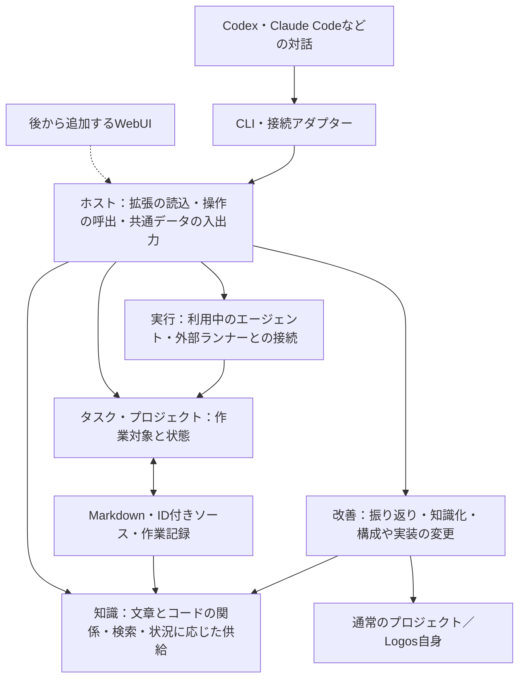

# Logos 初期版の設計

言語は名前の定義・値・文・出現を基本にする。採用した構造の理由は [言語設計の判断](decisions/language-model.md)、構文と意味規則は [言語仕様](ONTOLOGY.md) に記す。

作成日：2026-09-10

更新日：2026-09-14（説明末尾の定義、短いID、後置ソースID、カンマでまとめる記法へ統一）

状態：初期実装の基準となる設計。現在の実装範囲と確認結果は [確認記録](VALIDATION.md)、操作方法は [利用手順](USAGE.md) を参照。

~~~logos
def logos-design
  is document
  concerns search-knowledge, logos-ontology, logos-extensions, logos-usage, logos-adr-as-knowledge, create-host, host, logos-language-review
  about logos-change
~~~

## 1. 目的と設計の判断基準

Logosは、エージェントが状況に合った知識と実行方法を利用して仕事を進め、その経験や外部から得た情報を使って、自身の知識・能力・構成を改善していくための基盤である。

利用者が毎回、関連資料や注意点、作業方法を一から教える負担を減らす。改善の対象には、知識、ツール、エージェントの設定、作業手順、知識の選び方、評価方法、本体や拡張機能の実装を含む。既存の問題を直すことに加え、新しい能力や方法を獲得できることを目指す。

普段の入口はCodexやClaude Codeなどでの対話とする。そこから知識を参照し、作業を進め、必要なら別の実行方法へ委譲する。WebUIは後から追加し、知識の検索・閲覧・グラフ表示、タスクや進捗、接続プロジェクトの確認と補助操作に使う。

文章による説明はMarkdown、プログラムは実装ソースを原本とする。知識のMDはLogos内で管理し、ソースには短いIDコメントだけを置く。MD側からコードのIDを参照することで、資料の章、概念、判断基準、実装、利用可能な機能を結ぶ。エージェントは知識から実装へ、実装から意味や根拠へ辿り、そのつながりを使って仕事と改善を進める。

初期版では、次の基準で実装範囲を決める。

1. 目的に必要な流れを、実際に使える形で一周成立させる。
2. 後からの変更が、蓄積した知識や多数の拡張機能に波及する部分を先に設計する。
3. 具体的な用途がない抽象化や、将来の可能性だけを理由にした仕組みは追加しない。
4. 通常の利用・変更は、利用者とエージェントの善意を前提にする。
5. 知識の消失など、損失が大きい操作には初期から保護を設ける。

過去の資料は目的を理解する参考とする。過去の実測・検証結果、資料に書かれた作り直しの理由、各版の厳密な管理要件は、この設計の根拠として引き継がない。

~~~logos
def logos-design-purpose
  is document
  part-of logos-design
~~~

## 2. 初期版でできること

最初に、通常のプロジェクトでの仕事と、Logos自身を改善する仕事を、同じ仕組みで扱えるようにする。

| 利用場面 | 初期版の動作 |
|---|---|
| 対話中に必要な知識を得る | タスク、プロジェクト、現在の状況から、関連知識・判断基準・手順・利用可能な能力を取得する。選ばれた理由と出典も辿れる |
| 作業を進める | 対話中のエージェントがそのまま作業する経路と、登録された実行アダプターへタスクを渡す経路を持つ |
| 状況を更新する | タスクの状態、途中で分かったこと、成果物、確認結果を記録し、必要な知識を引き直せる |
| 経験を次回に生かす | 修正や発見を、適用範囲と出典を持つ知識として追加・更新し、次のタスクで利用できる |
| 自分の構成を理解する | 利用可能な機能、その目的、依存先、実装場所、関連する設計や知識を調べられる |
| 自分を改善する | エージェントが構成や実装を調べ、知識・設定・拡張機能・本体を変更し、動作を確認して次の利用へ反映できる |
| 複数のプロジェクトを扱う | 対象プロジェクトを選び、プロジェクト固有の知識と共有知識を併せて利用する |

初期版は単一利用者のローカル環境を想定する。Logosの開発作業で利用するが、知識やタスクの共通部分には、コード変更やGitリポジトリを必須とする項目を入れない。

~~~logos
def logos-design-capabilities
  is document
  part-of logos-design
~~~

## 3. 本体と拡張の構造

単一のローカルアプリケーションとして始める。小さなホストと、標準で同梱する拡張機能を、同じプロセスで動かす。

~~~logos
def logos-design-architecture
  is document
  part-of logos-design
~~~

### ホストが持つもの

- 有効な拡張機能を読み込み、操作を名前で登録・呼び出す仕組み。
- 共通のID参照と取得の窓口。原本の読込や対象範囲の解釈は、知識拡張の読取器へ任せる。
- 呼出時のプロジェクト、作業ディレクトリ、タスクIDなどを渡す共通の文脈。
- 登録された機能を一覧し、その説明と実装場所を取得する仕組み。
- 管理するファイルや作業記録の競合検出・原子的な保存を支える共通処理。

知識の順位付け、作業手順、モデル選択、振り返り方などの方針は、標準拡張側に置く。ホストを小さくするために必要機能を削らず、必要機能を交換できる場所に置く。

ホストも通常のソースコードとして変更可能にする。初期版では、稼働中のホストの自己書換えや、その場での入替えは扱わない。変更は確認後、次の起動から使う。

### 拡張機能の単位

拡張は、意味のまとまりごとのモジュールとする。初期には「知識」「タスク・プロジェクト」「実行」「改善」を標準拡張として同梱する。機能ごとに細かいパッケージを量産する必要はない。

拡張の定義には、ID、目的の説明、必要な拡張、提供する操作、設定、実装の入口を持たせる。各操作には、名前、説明、入力・出力の形、処理本体を対応付ける。ホストは同じ定義を、実際の呼出と、エージェント向けの機能説明に利用する。

操作には、対応する実装ノードのIDを持たせられる。注釈から得た「何を実装しているか」と、登録情報から得た「現在どう呼び出せるか」を、このIDで接続する。注釈を読み取るだけでは、対象コードを実行・登録しない。

| 初期から決める約束 | 後からの変更負担を減らす理由 |
|---|---|
| `knowledge.context` を含む操作名は拡張IDを含む | 別の拡張を追加しても名前が衝突しにくい |
| 外から使う操作は、構造化した入力・出力を持つ | CLI、対話接続、後のWebUIが同じ機能を呼べる |
| 拡張間の呼出は公開された操作を使う | 別の拡張の保存形式や内部クラスへの依存を抑える |
| 実行環境の情報は呼出の文脈として渡す | 特定の対話製品や作業ディレクトリへの埋込みを避ける |
| 定義の読込時に、依存不足と操作名の重複を検査する | 起動しているように見えて一部だけ壊れている状態を減らす |

操作一覧、レコードの取得、操作の実行ができれば、新しい拡張を入口ごとに作り直す必要はない。初期の呼出は通常の関数呼出でよく、通信基盤やイベントバスを追加しない。

開発中の破壊的変更は、仕様・実装・利用側を同時に変更する。旧形式・旧APIの併設や自動的な互換変換の仕組みは設けない。

拡張はローカル設定に明示したものを読み込む。配布マーケット、依存パッケージの自動導入、動的なホットリロード、拡張同士の権限隔離は後回しにする。

## 4. 知識と自己記述の情報モデル

言語の単位は名前付きの定義、値、述語と順序付き引数の文、原本上の出現とする。属性と関係の記述経路を分けず、文書・基準・述語・タスクに排他的な種類欄を要求しない。

`is` は全親の文と本文・条件を無条件に引き継ぐ。具体的な文書も共通条件を同じ方法で受け取る。同じ文は出典を併合し、一意性の衝突は保持して診断する。上書き、親の優先順位、部分的な除外を設けない。全内容を引き継げない場合は共通部分を別の親にする。

文書の話題は `about`、基準は `governed-by`、検索で使った概念は `used-concept` で表す。包含や依存から継承を推測しない。

意味の原本はLogos内のMarkdownとし、各定義は対象見出しに続く説明の末尾に置く。ソースは元のリポジトリに置き、対象の直後に置く短いIDコメントへMDから接地する。語彙、値型、継承、署名の契約は [ONTOLOGY.md](ONTOLOGY.md) に定める。

~~~logos
def logos-design-information-model
  is document
  part-of logos-design
~~~

## 5. 状況に合った知識を供給する

1. タスク本文をBM25方式で知識本文に検索し、追加の検索プロバイダーがあれば順位を統合する。元の本文を動詞だけに縮めない。
2. 類似度順の知識に付いた話題の概念IDを取得する。基準からは、その基準を指す概念へ逆引きする。
3. 呼び出し側が既に特定できている概念IDを合流する。
4. 全親の定義・基準と関連知識を索引から取得し、登録済みの判断ロジックで追加・除外・未確定を処理する。その後にページ分割する。
5. タスクには実際に使った概念IDを記録し、同じ索引へ反映する。検索全体のスナップショット保存や受渡しは要求しない。

`knowledge.context` がこの一連の入口であり、本文のみでも呼び出せる。`knowledge.discover` と `knowledge.get` は必要な候補・定義確認に使う。既知の概念IDは `concepts`、ソースなどのIDは `targets` として区別する。

共有知識と対象プロジェクトの範囲を使う。関係探索には方向・深さ・件数の上限、出力にはページ分割を設ける。全親の探索を本文検索の順位で打ち切らない。参照切れ、循環、属性衝突、検索候補の曖昧さは結果に残す。

判定操作は知識IDごとに `include / exclude / unknown` と理由を返す。追加・除外を実際の供給結果に反映し、競合する判定は除外を優先する。未確定は診断とともに利用側へ渡す。自然文の条件を処理系が自動証明するわけではない。今回の資料の除外は、継承関係の取消ではない。

~~~logos
def logos-design-knowledge-supply
  is document
  part-of logos-design
~~~

## 6. タスク、実行、改善をつなぐ

~~~logos
def logos-design-execution-improvement
  is document
  part-of logos-design
~~~

### 二つの作業経路

対話中のエージェントが作業する場合は、知識を取得し、対象プロジェクトで作業し、必要な結果をLogosに記録する。知識の参照だけなら、タスク登録を必須にしない。

作業を委譲する場合は、実行拡張へ、タスクID、対象プロジェクト、目的、必要な文脈、利用する実行アダプターを渡す。アダプターは外部エージェントや既存ツールに接続し、状態と結果をタスクに戻す。両方の経路で同じ知識供給とタスク操作を使う。

初期のタスクには、目的、プロジェクト、状態、状況のメモ、利用した知識・実行方法への参照、成果物の場所、確認結果を保持する。状態は未着手・実行中・待機中・完了・失敗・中止から始め、厳密な工程管理は追加しない。完了は実行側の報告で更新でき、確認結果がなければそのまま未確認と表示する。

委譲前に実行IDを保存し、タスクとは区別して試行を記録する。中断後に結果が不明なら、自動再実行せず状態を確認する。初期は手動の再開でよく、常駐キューや複雑な再試行制御は作らない。

CLIを最初の入口とし、利用環境に合わせた対話接続と、一つの実行アダプターを実装する。接続先ごとの呼出方式は実装時に確認して選ぶ。Skills、MCP、Hooks、既存SDKなどは必要な接続に利用し、すべてを初期の必須機能にはしない。

### 改善を初期版から一周させる

改善拡張は、タスクの結果、利用者の修正、外部資料、新しい仮説から、改善の作業を起こせるようにする。初期の判断と変更作業は、対話中または委譲先のエージェントが担う。

1. 経験や新しい情報から、改善したい点と期待する効果を短く記録する。
2. 共通の関係から、知識、機能の説明、設定、実装、確認方法を辿る。
3. 知識の追記、設定の変更、拡張の追加・交換、必要なら本体の修正を行う。
4. 対象に応じたテストで結果を確認し、変更内容と確認結果を記録する。
5. 保存後の索引を更新し、更新された知識・関係・構成を次の作業で利用する。動作するコードを変更した場合は、確認後の次回起動から反映する。

同じエージェントが提案・変更・評価を進めてよい。独立した審査者、評価項目の改変禁止、複数段階の承認は初期には要求しない。期待した効果と、実際に確認できたことは記録上区別する。

振り返りではログ全体をそのまま一般知識にせず、使い回せる内容、適用範囲、出典を取り出す。一件の経験なら、まずそのプロジェクトや状況に限定して保存できる。知識を増やすだけでなく、重複の整理、誤りの修正、不要な機能の廃止も改善に含める。

Logos自身は、通常の作業対象プロジェクトとして登録する。自身の実装を変更する際も、通常の編集・確認・Gitブランチの流れを使う。並列作業で必要ならworktreeを使う。独自の版管理、複数リポジトリの一括固定、稼働中の自己更新機構は作らない。

## 7. 保存と索引

MD・ソース・共有設定は通常のGitで管理する。知識グラフと検索データは原本から生成する。タスク・試行は実行中の状態を持つローカル記録である。

`.logos/index.json` にファイル単位の解析済みノードを永続化する。保存・変更・移動・削除で該当ファイルを再解析し、派生グラフと継承・語句検索データを更新する。未変更の問い合わせは同じグラフを再利用する。タスクのJSONも同じ索引へ直接追加し、問い合わせごとの全タスクのMD化や二重のグラフ構築を行わない。

常駐中の監視に加え、起動・アクセス時にファイルの変更情報を照合する。変更していない原本の本文は読まない。現在は変更時の派生グラフを全体再計算し、再起動では保存済みノードから合成する。将来必要になれば依存部分だけの更新へ改める。索引は原本ではなく、破損した場合は再生成する。

原本の競合検知はファイル単位のハッシュで行う。語彙や親の変更による再解析結果も同じ索引へ反映する。開発版の言語更新で旧形式・旧APIを併設しない。

知識の削除は範囲を確認した原本の編集として行い、ごみ箱・復元API・削除済み台帳は持たない。差分と記録済みの版の復元はGitを使う。自動コミットやGitのラッパーは設けない。タスクは完了・取消後も保持する。試行の状態・結果不明からの再開制御は実行の重複を避けるために残す。具体的な手順と保存先は [USAGE.md](USAGE.md) に記載する。

~~~logos
def logos-design-storage
  is document
  part-of logos-design
~~~

## 8. 実装の順序と完了の目安

Logos自身の知識取得・変更・検証を通して改善を進める。説明用の別プロジェクトや架空の概念群は作らず、共通概念から実際の変更基準を取得し、その実装と検証へ辿る。

知識供給では、本文検索、既知IDとの合流、全親の継承、判定操作、使用概念の記録を確認する。保存では章の境界、競合検出、Git復元後の索引更新を確認する。実行では試行IDと結果不明の扱い、判定結果の記録を確認する。

新機能は通常の拡張登録で追加する。公開操作の説明には `quality.documentation`、リポジトリの知識記述には `audit:knowledge` を使う。実際の運用で不足が確認された部分から設計を詳しくする。

~~~logos
def logos-design-roadmap
  is document
  part-of logos-design
~~~

## 9. 設計判断と今後の運用

| 今回の設計で採ること | 今決める理由 |
|---|---|
| 小さなホストと標準拡張、入口をまたいで共通の操作 | 後からUIや接続先を追加する際の本体改修を減らす |
| 場所から独立したID、意味を持つ関係、適用範囲、出典 | 蓄積した知識を移動・再利用・修正できる土台になる |
| 原本・注釈と、共通グラフを使う処理の分離 | 対応するソース言語や注釈記法を増やしても、利用側への変更の波及を抑える |
| 注釈の対象範囲と、プロジェクト範囲・適用条件の区別 | ファイル内の配置と、知識の意味や適用先を混同しない |
| ソースの実装IDと、実際の操作登録の接続 | エージェントが説明・コード・呼出方法を行き来できるようにする |
| 対象プロジェクトとLogosの保存場所の区別 | 他のプロジェクトの作業と、自身の改善を同じ仕組みで扱う |
| Gitによる原本の履歴管理と保存時の競合検出 | 履歴管理を重複させず、未保存の同時編集の上書きを防ぐ |

次の事項は、Logosの運用を通じて判断する。必要な時点までに決めればよく、今すべてを設計しない。

- どの判断基準や適用判定を、文章での利用から実装による判定へ進めるか。
- どのソース言語の読取器・実行接続を次に追加するか。
- 全文検索、埋め込み、グラフ探索、エージェントの解釈をどう組み合わせると使いやすいか。
- 頻繁に使う作業のうち、どこを自動実行や定期実行にするか。
- WebUIにどの表示・操作を追加するか。
- 利用者や実行環境が増えたとき、どの管理や保護を強化するか。

この設計の良し悪しは、初期の機能が動くことに加え、次の機能追加や改善をしたときの変更範囲で確かめる。使う前に完成形を決め切ることは、初期版の目標に含めない。

~~~logos
def logos-design-decisions
  is document
  part-of logos-design
~~~
